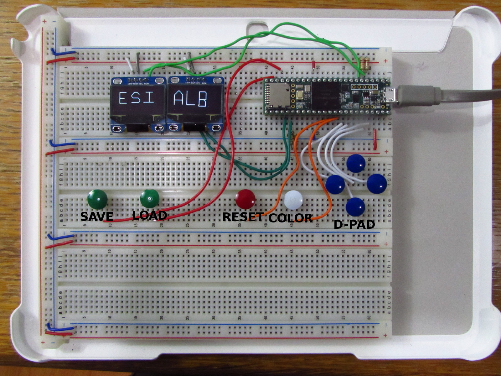

# Teensy 3.6 Etch-A-Sketch

Simple etch-a-sketch project using a [Teensy 3.6](https://www.pjrc.com/store/teensy36_pins.html), two [I2C OLED displays](https://www.amazon.com/Diymall-Serial-128x64-Display-Arduino/dp/B00O2KDQBE/), and touch controls.  Save and Load functionality is supported via the MicroSD card slot.

Rather than the .ino files of an Arduino IDE sketch, this project is built with [PlatformIO](http://platformio.org/).  PlatformIO is a much better system for larger projects where the term "sketch" no longer really applies.



## Pin Connections

Touch Pins:

| Teensy Pin | Connected To |
| ----- | ----- |
| 23 | D-PAD up touch contact |
| 22 | D-PAD right touch contact |
| 18 | D-PAD down touch contact |
| 19 | D-PAD left touch contact |
| 17 | INVERT touch contact |
| 16 | RESET left touch contact |
| 29 | LOAD touch contact |
| 30 | SAVE left touch contact |

I2C Pins:

| Teensy Pin | Connected To |
| ----- | ----- |
| 3 | SCL2 pull-up resistor, left OLED display |
| 4 | SDA2 pull-up resistor, left OLED display |
| 38 | SDA1 pull-up resistor, right OLED display |
| 37 | SCL1 pull-up resistor, right OLED display |

## Uploading

First, install python's pip:

```bash
sudo apt-get install python-pip
```

Then, install platformio:

```bash
pip install platformio
```

Then plug in the Teensy, build, and upload the project:

```bash
platformio run -t upload
```

